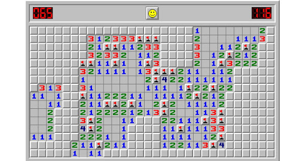

### General Assembly Software Engineering Immersive

# Project One: ZombieSweeper


## The Overview:

The project set by General Assembly is a one week individual coding task using HTML5, CSS3 and ES6 to build a functional website grid game. 

In order to challenge my functional logic writing skills I chose Minesweeper, which requires difficult recursive functions, responsive grid creation for difficulties and an interesting mobile function difference. 

You can play my game here: [](https://jschenk8.github.io/GAProject-1/)

### Minesweeper:



Minesweeper is a classic Microsoft Windows grid game.

A grid of cells, or 'mine field' is shown. By left clicking, a player 'digs' to reveal either a mine, an empty cell, or a number. 

Numbers show how many neighbouring cells have bombs. If a player discovers an empty cell then all neighbouring cells are revealed repeatedly until all neighbouring empty cells are shown. 

If the player finds a bomb, they lose. 

The player can right click to place a flag - this marks a cell which the player believes has a mine. 

The player wins once all the cells which do not contain bombs are revealed. 

### The Brief

* Render a game in the browser
* Include seperate HTML / CSS / JavaScript files
* Deploy the game online
* Use Git for version control
* The game should be one player, against a computer
* The board should be automatically cleared when a level is completed
* Responsive design where possible
* Random board generation
* Different Board sizes
* Mobile optimisation if possible

### Technologies Used

* HTML5
* CSS3
* ES6
* Git and GitHub
* Google Fonts
* Local Storage

### Zombie Theme

I wanted to create a unique design which still made sense within the minesweeper game rules. Using Zombies was an easy way to have something to avoid (mines) and something to defend a cell (flags).

For ease of understanding, I will refer to zombies as mines and axes as flags throughout this ReadMe, so as to stick to understanding of the original game. 

## Creating the Game

I initially planned my code into individual steps, in short, they could be summed up as:

* Grid creation
* Bomb assignment
* Check each cell for neighbouring bombs and assign numbers or empty values
* Event listeners
* Iterative revelation of empty cells
* Game Over and Winner Functions
* Rules Modal
* Zombie Themed CSS
* High score using Local Storage
* Mobile game play

###Grid Creation

The HTML contained a div with the class of 'grid' which could be selected in JavaScript. A for loop was then used to create individual cell divs inside of this div, as shown below:

```
//! Grid Creation button:
function createGrid() {
  for (let i = 0; i < width * height; i++) {
    // ? Generate each element
    const cell = document.createElement('div')
    cell.classList.add('cell')
    cell.setAttribute('display', 'off')
    cell.setAttribute('checked', 'false')
    cell.id = `${i}`
    grid.appendChild(cell)
    cells.push(cell)
    // ? Set the width and height of cells
    cell.style.width = `${100 / width}%`
    cell.style.height = `${100 / height}%`
  }
}
```

By using variables for width and height inside of this code, I could then change the grid size for different difficulties by changing these variables and calling the same createGrid() function. 

I created a drop down menu of difficulties and created an event listener which responded to a change in the menu selection. 

This would reset the old grid and replace it with the correct size of grid, 10x10 for easy, 18x14 for medium and 24x20 for hard. The overall size of the grid was also changed to appropriately fill the screen.

### Bomb Assignment

The bomb assignment was complicated by the fact that it was only triggered by the player's first click, and this cell had to be empty in order for the game not to be over from the first click. 

To do this, I fed the function the ID of the cell clicked, and created an array of it and all its neighbouring cells. Then, the bombs were created using a random number generator, which checked one at a time that the random number was both unique, and not the ID of one of the cells surrounding the first clicked cell. 

The function assigned the class of bomb to any cell containing a bomb. 

```
function assignBombs(firstClickNumber) {
  const bombArray = []
  const noBombCells = cellsToCheck(firstClickNumber)
  while (bombArray.length < numBombs) {
    const randomNumber = Math.floor(Math.random() * (width * height))
    if ((bombArray.indexOf(randomNumber) === -1) && (noBombCells.indexOf(randomNumber) === -1)) {
      bombArray.push(randomNumber)
    }
  }
  for (let i = 0; i < bombArray.length; i++) {
    document.getElementById(`${bombArray[i]}`).classList.add('bomb')
    document.getElementById(`${bombArray[i]}`).value = 'bombId'
  }
}
```
### Checking cells and assigning numbers

Knowing which cells to check was fairly straight forward: a conditional statement checked where the cell was in relation to the boundary conditions (the four edges of the grid) and created an array of all its neighbouring cells. 

```
function cellsToCheck(cellClicked) {
  if (cellClicked === 0) {
    return [cellClicked, cellClicked + 1, cellClicked + width, cellClicked + width + 1]
  } else if (cellClicked === (width - 1)) {
    return [cellClicked, cellClicked - 1, cellClicked + width, cellClicked + width - 1]
  } else if (cellClicked === (cells.length - (width))) {
    return [cellClicked, cellClicked + 1, cellClicked - width, cellClicked - width + 1]
  } else if (cellClicked === cells.length - 1) {
    return [cellClicked, cellClicked - 1, cellClicked - width, cellClicked - width - 1]
  } else if (cellClicked < width) {
    return [cellClicked, cellClicked - 1, cellClicked + 1, cellClicked + width, cellClicked + width - 1, cellClicked + width + 1]
  } else if (cellClicked % width === (width - 1)) {
    return [cellClicked, cellClicked - 1, cellClicked - width, cellClicked + width, cellClicked - width - 1, cellClicked + width - 1]
  } else if (cellClicked + width >= width * height) {
    return [cellClicked, cellClicked - 1, cellClicked + 1, cellClicked - width, cellClicked - width - 1, cellClicked - width + 1]
  } else if (cellClicked % width === 0) {
    return [cellClicked, cellClicked + 1, cellClicked - width, cellClicked + width, cellClicked - width + 1, cellClicked + width + 1]
  } else {
    return [cellClicked, cellClicked + 1, cellClicked - 1, cellClicked + width, cellClicked - width, cellClicked - width - 1, cellClicked - width + 1, cellClicked + width - 1, cellClicked + width + 1]
  }
}
```

To then assign the correct numbers this function was run on every cell and a counter kept track of how many neighbouring cells contained bombs and assigned this counter as the number. If the cell had no neighbouring bombs, it was assigned empty. 


### Event Listeners

Event listeners were added to left and right click. The left click ran a 'dig' function, which would check what the class of the cell underneath was. 

If it was a bomb, the game was over. If it was a number, it simply revealed the number. However, if it was empty, it ran a revealEmpty() function. More on this later. 

The right click added the class of 'flag' to a cell. This showed up as an axe on screen. If the cell already contained a flag, right clicking on it would remove the flag. And flags could not be placed on already revealed cells. 


### Revealing Empty Cells

This was a recursive function which, when fed a cell with the class 'empty', checked all neighbouring cells. 

For each neighbouring cells, it ran itself again, checking how many of the next cell's neighbours contained numbers or empties. Every time it ran across an empty cell, it ran the whole function all over again. If it came across a number, it simply revealed this cell. 

This took some refinement to avoid entering endless logic loops. One fix was to assign each cell a value of 'checked' so that the computer knew to only check it once. 

The whole function is shown below:

```
function revealEmpty(cell) {
  cell.setAttribute('display', 'on')
  cell.setAttribute('checked', 'true')
  cell.classList.add('emptyOn')
  revealedSquares++
  const neighbourArray = cellsToCheck(Number(cell.id))
  for (let i = 1; i < neighbourArray.length; i++) {
    const newCell = document.getElementById(`${neighbourArray[i]}`)
    if (newCell.getAttribute('checked') === 'true') {
      console.log('This cell has already been checked')
    } else if (newCell.classList.contains('number')) {
      revealNumber(newCell)
    } else if (newCell.classList.contains('empty')) {
      revealEmpty(newCell)
    }
  }
}
```

### Game Over and Winner Functions

When a player has cleared an entire board without pressing on any mines, a modal popped up to say "Well done" and record the time it took the player to complete the board. 


If a player clicked on a mine, all the miens were revealed and a modal told them they had lost. 


Both functions stopped the timer automatically, and had a 'Play Again' button which reset the board back to empty ready for another go at that difficulty. 

###Rules Modal

A button at the top of the page labelled 'The Rules' had an event listener on, so that when clicked a modal appeared and explained the rules of the game. This could be closed with a cross at the top right corner. 


### Zombie Themed CSS

Using google fonts, the header was set with a blood red color, and all the remaining text on the page was set as white with a 'spooky' cartoon feel. 

A CSS 'hover' function was added to each cell, so that when it was not revealed a bloody hand appeared over the cell. 

INSERT SCREENSHOT OF BLOODY HAND

The flag was a cartoon axe, this was to depict a defense against zombies. And when a mine was pressed, a blood splatter appeared on the cell. 

Various other bits of CSS were added to make the page more user friendly, such as hover pointers for any buttons and responsive header sizes for different size screens. 

### High Scores using Local Storage

Whilst high scores are not integral to a game of minesweeper, I wanted to have each player save their fastest time for each difficulty. As such, variables were created as items within local storage to hold easy highscores, medium highscores and hard high scores. 

Then, whenever the difficulty was changed, the variable was retrieved from local storage. 

The code below shows the event listener for diffuculty change, which gets the high score for that difficulty and displays it.

```
difficultyDropDown.addEventListener('change', (event) => {
  if (event.target.value === 'easy') {
    document.getElementById('displayHighScore').innerHTML = `${localStorage.getItem('easyHighScore')}`
  } else if (event.target.value === 'medium') {
    document.getElementById('displayHighScore').innerHTML = `${localStorage.getItem('mediumHighScore')}`
  } else {
    document.getElementById('displayHighScore').innerHTML = `${localStorage.getItem('hardHighScore')}`
  }
})
```

### Mobile Game Play 

The immediate difficulty presented with playing minesweeper on mobile is the lack of a right click function on touch screen. 

To overcome this, I put in two buttons which appeared below a screen width of 1024px. One button was for 'dig' and the other for 'flag'. By pressing each one, a player was able to decide which function they wished to use on each cell they clicked. 


Furthermore, for mobile friendly viewing, the dropdown for difficulty change was hidden, so that only an easy grid could be played. This was also increased in size to fill more of the screen and make it easier to play for those with larger thumbs. 


## Lessons Learnt

I thoroughly enjoyed this project and it was a great chance to improve my logical writing skills. 

I learnt how to effectively use recursive functions and avoid infinite loops. 

I struggled initially with applying my theoretical design using CSS and this project was a perfect chance to utilise these skills to get the finished product looking how I wanted it. 